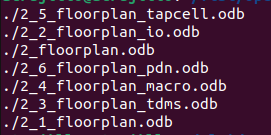
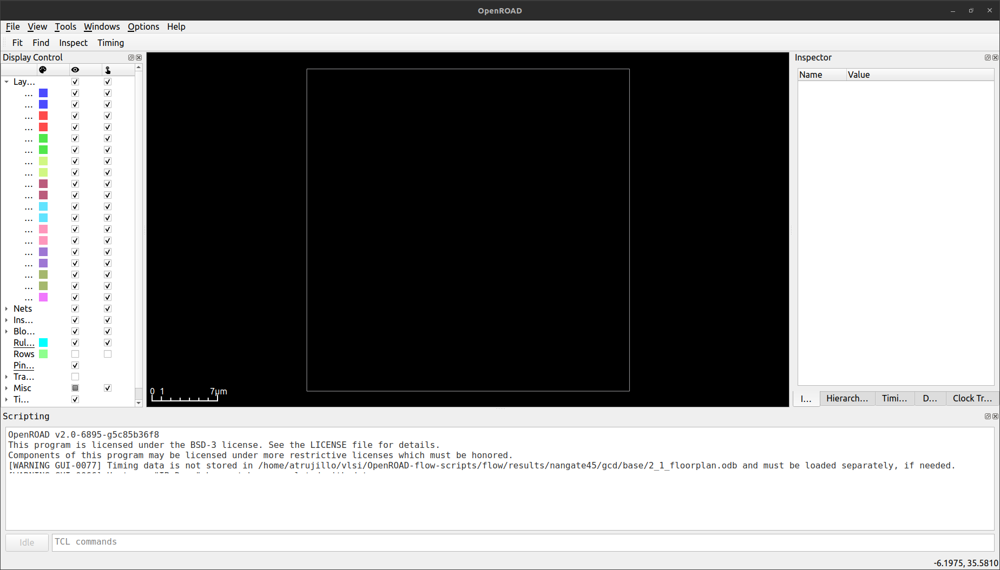
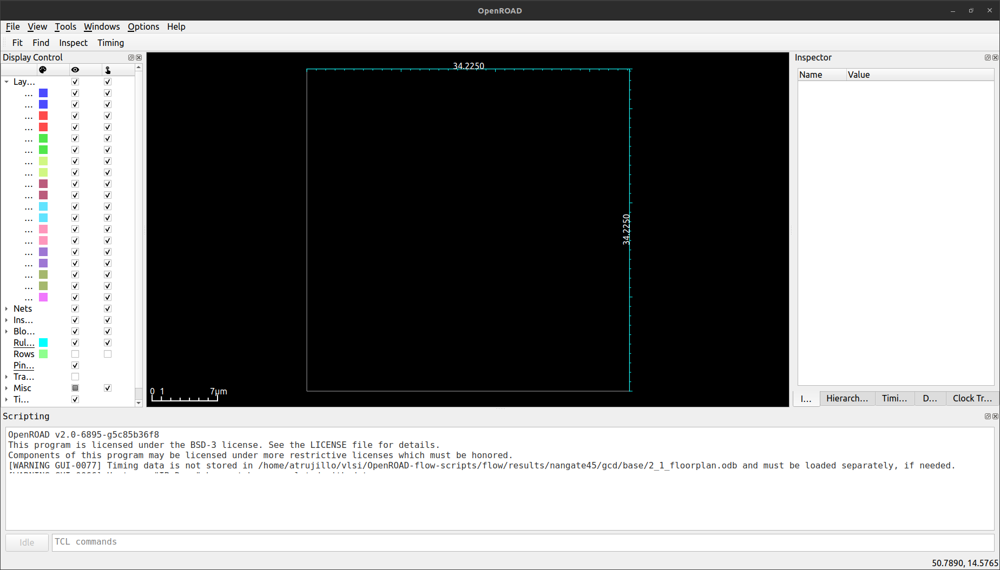
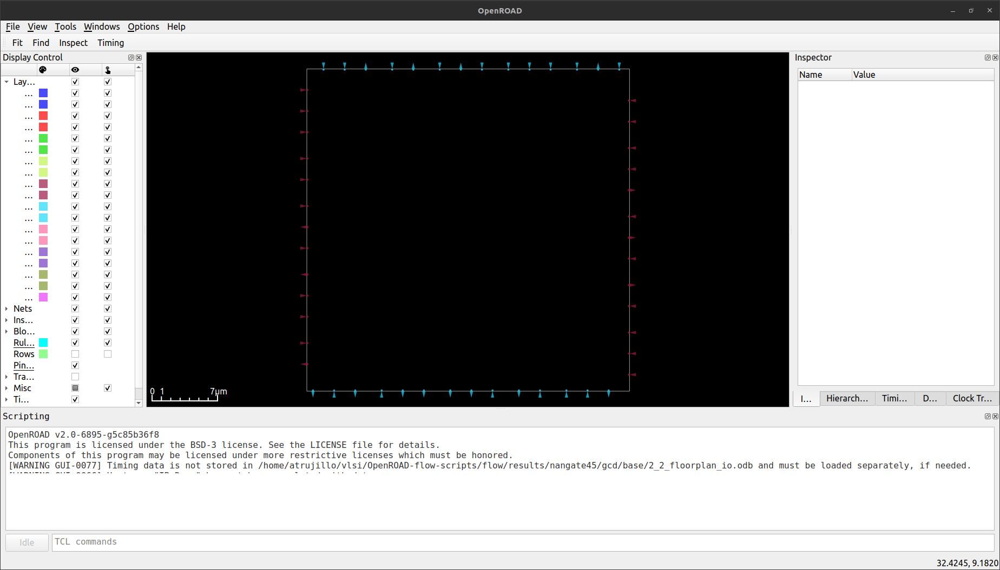
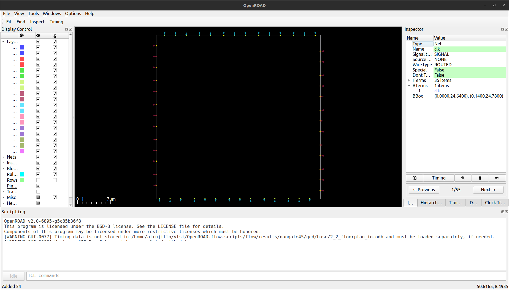
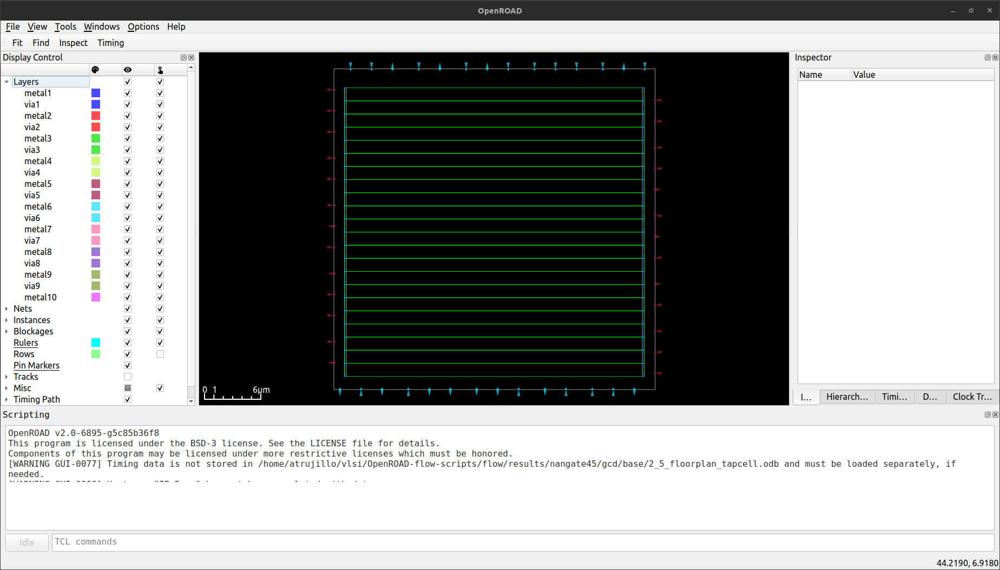
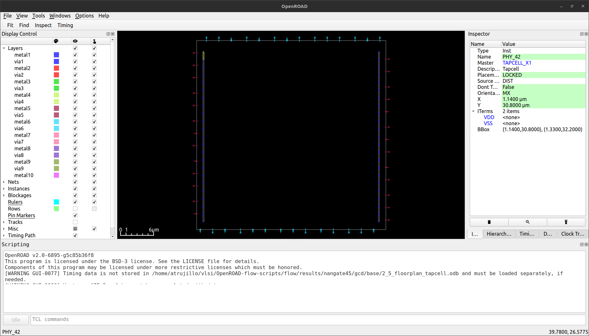
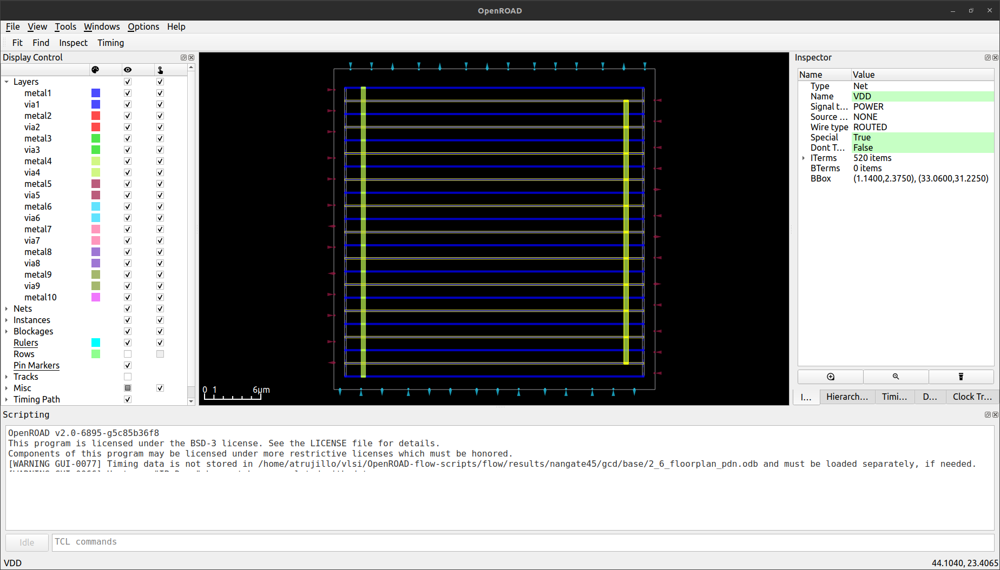

# Running the flow step by step

---

## Lab 1: Synthesis and Floorplan.

The following tutorial explains how can run synthesys and floorplan step by step, what happend in the synthesis flow and how can perform a floorplan flow by terminal and GUI.

**If you have run a flow, please use this command**

```shell
make clean_all
```
**This command cleans all flows that you been run, be carefull if you not want to delete a flow for a design**

For example if you have run a flow for gcd with a nangate45, run this command

```shell
make clean_all DESIGN_CONFIG=./designs/nangate45/gcd/config.mk
```
<details close>
   <summary> <h2> Running synthesis step </h2> </summary>

 Run `make synth`, you can watch something like this:

 ```
 .
 .
 .
 1. Executing Verilog-2005 frontend: ./designs/src/gcd/gcd.v
 2. Executing Liberty frontend.
 3. Executing Verilog-2005 frontend: ./platforms/nangate45 /cells_clkgate.v
 .
 .
 .
 Yosys 0.13+15 (git sha1 bc027b2ca, gcc 11.3.0-1ubuntu1~22.04 -fPIC -Os)
 Time spent: 29% 2x abc (0 sec), 9% 24x opt_expr (0 sec), ...
 Elapsed time: 0:01.81[h:]min:sec. CPU time: user 1.76 sys 0.04 (99%). Peak memory: 33800KB.
 mkdir -p ./results/nangate45/gcd/base ./logs/nangate45/gcd/base ./reports/nangate45/gcd/base
 cp results/nangate45/gcd/base/1_1_yosys.v results/nangate45/gcd/base/1_synth.v
 mkdir -p ./results/nangate45/gcd/base ./logs/nangate45/gcd/base ./reports/nangate45/gcd/base
 cp designs/nangate45/gcd/constraint.sdc results/nangate45/gcd/base/1_synth.sdc
 ```

 At the end of the messages you can see where is created the netlist and sdc files.

 Open the generated netlist for the design:

 ```shell
 cd ./results/nangate45/gcd/base/
 vim 1_synth.v
 ```

 Open the generated sdc file for the design:

 ```shell
 vim 1_synth.sdc
 ```
 This sdc are the same as the original sdc.

 Some interesting outputs in the synthesis:

 - Elaborating the design, conversion of processes to netlist expressions
 ```
 4.3. Executing PROC pass (convert processes to netlists).
 4.3.1. Executing PROC_CLEAN pass (remove empty switches from decision trees).
 4.3.2. Executing PROC_RMDEAD pass (remove dead branches from decision trees).
 4.3.3. Executing PROC_PRUNE pass (remove redundant assignments in processes).
 4.3.4. Executing PROC_INIT pass (extract init attributes).
 4.3.5. Executing PROC_ARST pass (detect async resets in processes).
 4.3.6. Executing PROC_MUX pass (convert decision trees to multiplexers).
 4.3.7. Executing PROC_DLATCH pass (convert process syncs to latches).
 4.3.8. Executing PROC_DFF pass (convert process syncs to FFs).
 4.3.9. Executing PROC_MEMWR pass (convert process memory writes to cells).
 4.3.10. Executing PROC_CLEAN pass (remove empty switches from decision trees).
 4.3.11. Executing OPT_EXPR pass (perform const folding).
 ```

 - Excecuting optimizations
 ```
 4.4. Executing FLATTEN pass (flatten design).
 4.5. Executing OPT_EXPR pass (perform const folding).
 4.6. Executing OPT_CLEAN pass (remove unused cells and wires).
 4.7. Executing CHECK pass (checking for obvious problems).
 4.8. Executing OPT pass (performing simple optimizations).
 ```

 - Mapping the design
 ```
 4.22. Executing TECHMAP pass (map to technology primitives).
 4.22.1. Executing Verilog-2005 frontend: OpenROAD-flow-scripts/tools/install/yosys/bin/../share/yosys/techmap.v
 4.22.2. Continuing TECHMAP pass.
 4.23. Executing OPT pass (performing simple optimizations).
 4.23.1. Executing OPT_EXPR pass (perform const folding).
 4.23.2. Executing OPT_MERGE pass (detect identical cells).
 4.23.3. Executing OPT_DFF pass (perform DFF optimizations).
 4.23.4. Executing OPT_CLEAN pass (remove unused cells and wires).
 4.23.5. Finished fast OPT passes.
 ```

 - Generating the verilog netlist
 ```
 17.  Executing Verilog backend.
 ```

 **If you want to examine the output in synthesis step, go to /logs directory**

 </details>

<details close>
    <summary> <h2> Running floorplan step </h2> </summary>

 Run `make floorplan`, this is the most important information in the log files:

- Core design area utilization

```
floorplan final report_design_area
--------------------------------------------------------------------------
Design area 548 u^2 56% utilization.
```

- Initialization of chip area
```
[INFO IFP-0001] Added 22 rows of 168 sites.
```

- I/O pin placement
```
Found 0 macro blocks.
Using 1u default distance from corners.
Using 2 tracks default min distance between IO pins.
[INFO PPL-0007] Random pin placement.
```

- The design do not have macros, therefore, the placement does not perform a global and macro placement

```
.
.
.
No macros found: Skipping global_placement
.
.
.
No macros found: Skipping macro_placement
.
.
.
```

- Insertion of tapcells, endcaps and generation of power grid
  
```
[INFO TAP-0004] Inserted 44 endcaps.
[INFO TAP-0005] Inserted 0 tapcells.
.
.
.
[INFO PDN-0001] Inserting grid: grid
```

- The floorplan step creates a DB files for every step, all data base file is in the next directory:

```shell
cd ./results/nangate45/gcd/base/
```

- Type the next command for find all .odb files

```shell
find . -type f -name "*.odb"
```



- You can invoke the GUI for see all steps performed in the placement, use:
```shell
source ../setup_env.sh
openroad -gui
```

- Once you opened the GUI, load the `2_1_floorplan.odb` file, you can see something like this:



- Use MAYUS+k for use the ruler and use it for measure the height and width.



- Close GUI and Re-Open

---

### Floorplan I/O distribution

- Open de odb file: `2_2_floorplan_io.odb`. You can view how I/O's are distributed around the floorplan.



- In the toolbar select `find`, change `type` to **port** and press OK. At your RHS window you can view a window called `inspector`, in that frame you can see details about how many nets have the design and his attributes.



- Close GUI and Re-open

---

### Floorplan end caps and tap cells distribution

  - Open de odb file: `2_5_floorplan_tapcell.odb`. You can view how is distributed the end caps and tap cells, this design only have 44 endcaps.



 - At your LHS window, you can see the **Display Control**, locate `Rows` and deselect it, once have been deselected you can watch the 44 endcap cells.



- Close GUI and Re-open

---

### Floorplan Power Delivery Network (PDN)

  - Open de odb file: `2_6_pdn.odb`. You can see the distribution of the Power Delivery Network. If you select the right yellow col, there been highlighted the VDD network, if you select the left yellow col there have been highlighted VSS network.


</details>

---


