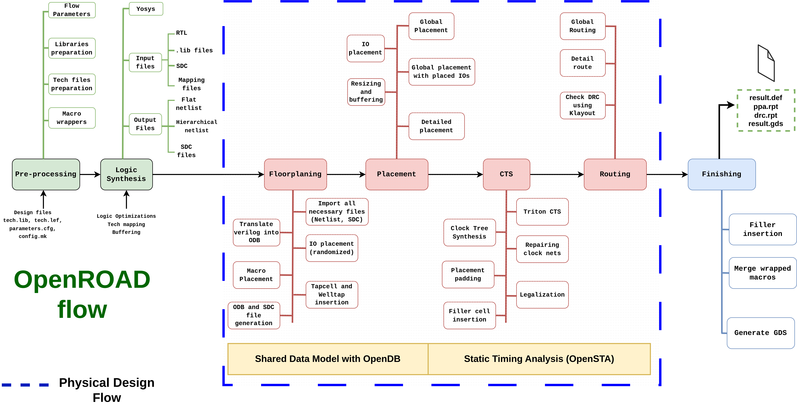

# Introducing the OpenROAD environment, tools and flow

In this tutorial, we introduce the structure of the OpenROAD environment, database access, features and tools.

For understanding the structure and how OpenROAD performs and autonomous flow we must know the basic structure for perform a complete design flow:

## Understanding the autonomous flow

The process begins with performing some preprocessing actions to set up the parameters, organize the libraries and tech files, and warp macros. Next, the logic synthesis stage is executed, whereby an RTL design is transformed into a mapped netlist. Subsequently, the physical design process, consisting of Floorplanning, Placement, Clock Tree Synthesis, and Routing, is carried out. Finally, a finishing step is performed to generate the GDS file and relevant reports.