# Running a basic flow for a design in OpenROAD
---
This document shows how to set up the platform and design configuration files to run the complete RTL2GDS flow using OpenROAD.

First, you need to source the ***setup_env.sh*** file located in the root directory of OpenROAD (OpenROAD-flow-scripts).

```shell
source setup_env.sh
```

The necessary platform and design configuration files are located in the directory called ***flow***.

```shell
cd flow
```

## Platform Configuration

To view this configuration, refer to the setup configuration file for ***sky130hd***.

```shell
less ./platforms/sky130hd/config.mk
```

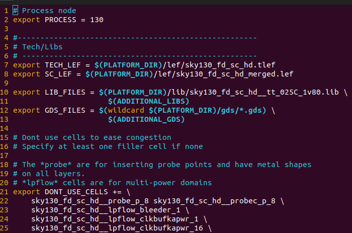

The *config.mk* file contains all the necessary variables for the sky130hd PDK platform, and it is recommended that **you do not change** any variable definitions.

If you want to learn more about the variables and how to customize your design flow, please refer to this page -> [Flow Variables](https://openroad-flow-scripts.readthedocs.io/en/latest/user/FlowVariables.html).

## Design configuration

To create a design, you must have a design configuration file to run the flow. You will need basic design-specific configuration variables, which are required to specify main design inputs such as the platform that has been used, the top-level design name, and constraints.

| Variable Name        | Description                                                                                                                                    |
|:--------------------:|:----------------------------------------------------------------------------------------------------------------------------------------------:|
| **PLATFORM**         | Specifies the PDK                                                                                                                              |
| **DESIGN_NAME**      | Specifies the name of the top-level module of the design                                                                                       |
| **VERILOG_FILES**    | The path to the verilog files of the design                                                                                                    |
| **SDC_FILE**         | Specifies the path of  the design constraints file                                                                                             |
| **CORE_UTILIZATION** | Specifies the core utilization percentage                                                                                                      |
| **PLACE_DENSITY**    | The desired placement density of cells, reflects how spread the cells would be on the core area. **1** = Closely dense. **0** = Widely spread. |

For understand the syntax of the design configuration file view the default design file for **ibex** design:

```shell
less ./designs/sky130hd/ibex/config.mk
```

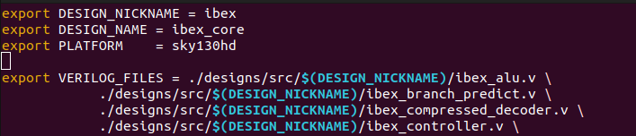

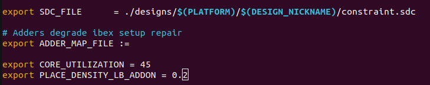

This is a basic configuration for the **ibex** design.

## Running the automated RTL2GDS flow

The OpenROAD application executes an entire automatic flow using TCL scripts that invoke open-source tools, from synthesis to GDS file creation without human intervention. However, in this section, you will learn both automated and a few interactive ways to run the TCL commands for flow stages.

In the OpenROAD-flow-scripts directory, users can access individual flow stages, the respective tools, and the corresponding readme for each tool and its commands, as well as examples using the TCL interface and other details.

OpenROAD employs a set of individual tools to perform the various stages of the design flow, such as synthesis, placement, and routing.

### Running the gcd design

For running the **gcd** design with the OpenROAD-flow-scripts automated flow you must follow a sequence of commands.

- Change your current directory OpenROAD-flow-scripts/ to flow/
  
  ```shell
  cd flow
  ```

- Run the complete flow with:
  
  ```shell
  make DESIGN_CONFIG=./designs/sky130hd/gcd/config.mk
  ```

**The complete flow for gcd takes 3 to 5 minutes it will vary based in your computer configuration**

If you have completed the RTL2GDS flow, then you proceed to view the final GDS file under results directory

`./results/sky130hd/gcd/base/`

If you encounter errors and need to restart the entire flow, you can delete the files for sky130hd/gcd using the following command:

```shell
make clean_all DESIGN_CONFIG=./designs/sky130hd/gcd/config.mk
```

To delete files related to individual stages of the flow like synthesis, CTS routing, or layout generation, you can use the following commands:

- To delete synthesis related files use:
   `make clean_synth DESIGN_CONFIG=./designs/sky130hd/gcd/config.mk`

- To delete floorplan related files use:
  `make clean_floorplan DESIGN_CONFIG=./designs/sky130hd/gcd/config.mk`

- To delete placement related files use:
  `make clean_place DESIGN_CONFIG=./designs/sky130hd/gcd/config.mk`

- To delete CTS related files use:
  `make clean_cts DESIGN_CONFIG=./designs/sky130hd/gcd/config.mk`

- To delete routing related files use:
  `make clean_route DESIGN_CONFIG=./designs/sky130hd/gcd/config.mk`

- To delete final stage related files use:
  `make clean_finish DESIGN_CONFIG=./designs/sky130hd/gcd/config.mk`

These commands will remove the corresponding files and directories for the specific stage.

### OpenROAD GUI

The GUI allows for selecting, highlighting, and navigating through the design hierarchy and design objects (nets, pins, instances, paths, etc.). The GUI provides a detailed visualization and customization options for users.

The GUI (Graphical User Interface) is a tool that enables users to interact with software visually through graphical elements such as buttons, menus, windows, icons, etc. In this case, it refers to a GUI for design software that enables users to select and work with different design elements such as nets, pins, instances, paths, etc. The GUI provides a detailed visual interface and customization options to enhance the design experience.

In the OpenROAD GUI you can watch:

- Design hierarchy.

- Load ODB files for floorplan and layout visualization.

- Trace the synthesized clock tree to view hierarchy and buffers.

- Use heat maps to view congestion and observe the effect of placement.

- View and trace critical timing paths.

- Set display control options.

- Zoom to object from inspector.

For the `gcd` design uncomment the `DESIGN_CONFIG` variable in the `Makefile`

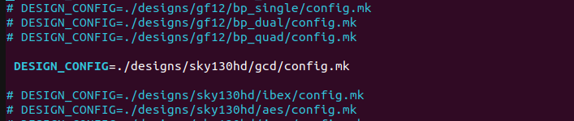

Use the next command

```shell
make gui_final
```

#### Viewing the layout results

The `make gui_final` command reads and loads the technology `odb` files and the parasitics, then, invokes the GUI in these steps:

The figure below shows the post-routed DEF for the gcd design.

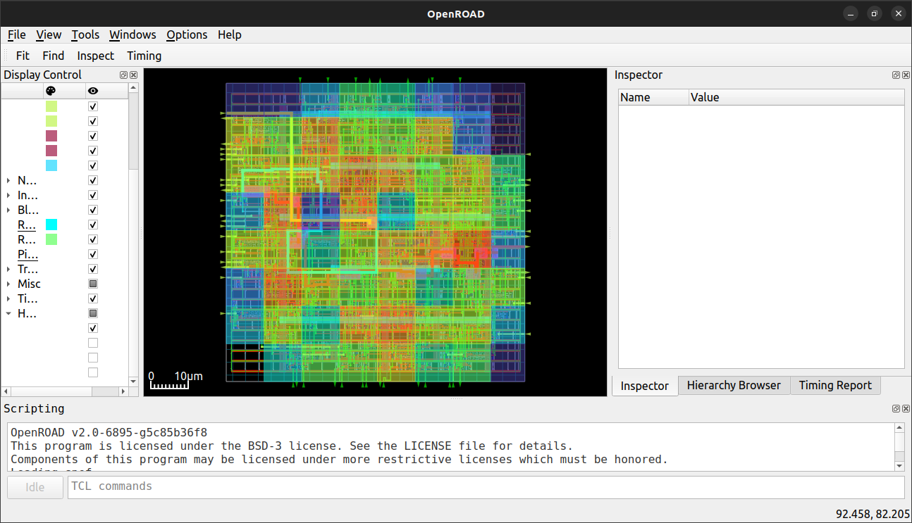

 At your LHS window, the Display Control shows buttons for color, visibility, and selection options for various design objects: *Layers*, *Nets*, *Instances*, *Blockages*, and *Heatmaps*.

In the RHS window, a user interface is shown to inspect the details of a selected design object and the timing report

##### Showing the Clock Tree in the design

You can observe the synthesized clock tree for the GCD design:

- From the top Toolbar click `view` - > `find`

- In the dialog box `find object` search the clock net using a keyword as follows:

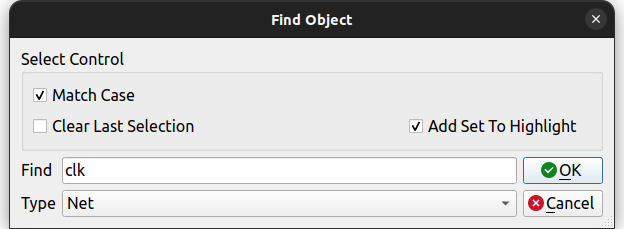

After clicking ***OK***, you can only observe the clock structure in the LHS window. Please disable the **layers**.

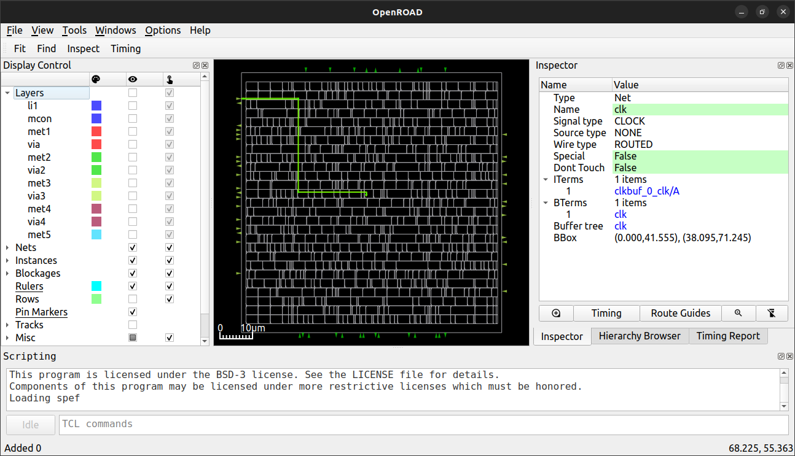 

##### Showing heat maps

From the Menu Bar, Click on Tools -> Heat Maps -> Placement Density to view congestion selectively on vertical and horizontal layers.

Expand Heat Maps -> Placement Density from the Display Control window available on LHS of OpenROAD GUI.

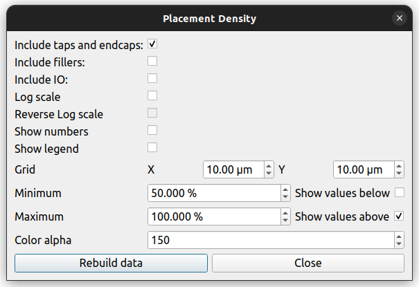

In the Placement density setup pop-up window, Select Minimum -> 50.00 Maximum -> 100.00%

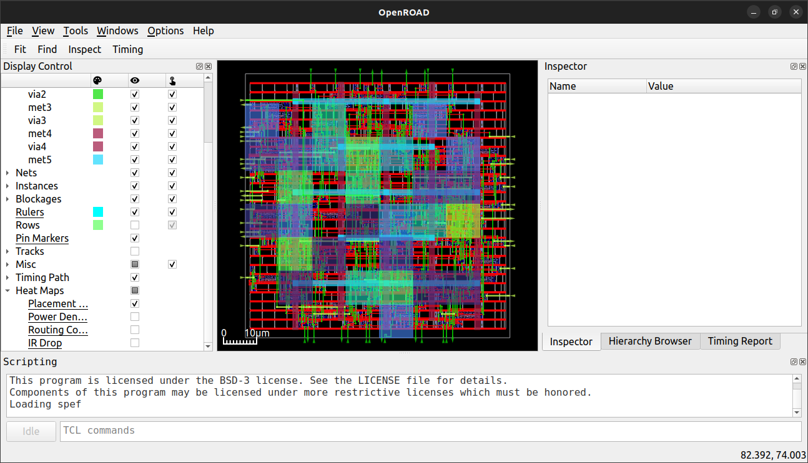

From Display Control select Heat Maps -> Routing Congestion as follows:

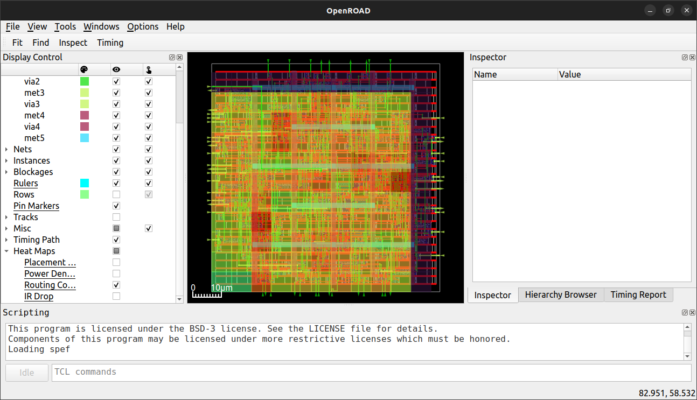

From Display Control, select Heat Maps -> Power Density as follows:

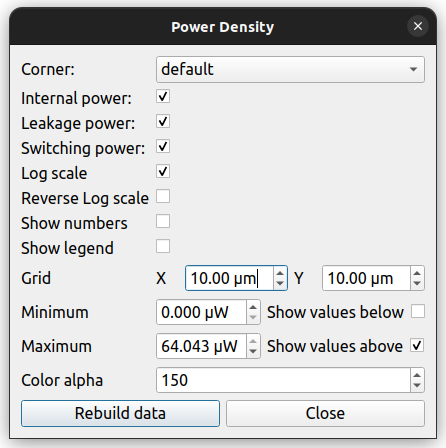
Then
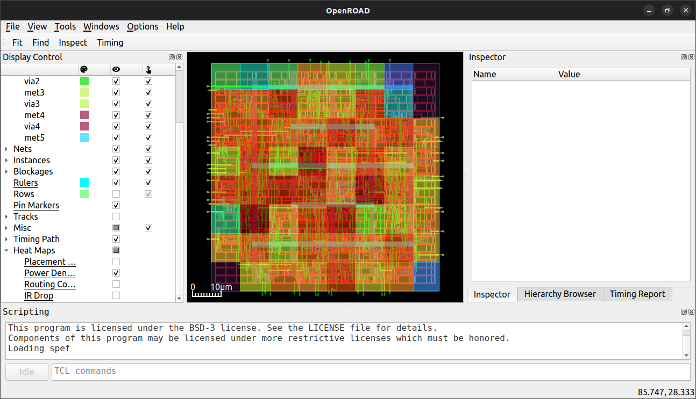

---

## Tools used in OpenROAD

---

### Synthesis (Yosys)

 It is a framework for RTL synthesis tools that currently supports extensive Verilog-2005 and provides a fundamental set of synthesis algorithms for various application domains. [The-OpenROAD-Project/yosys](https://github.com/The-OpenROAD-Project/yosys/blob/master/README.md).

### Database files (OpenDB)

OpenDB is a design database that supports physical chip design tools. Its structure is based on the text file formats of LEF (library) and DEF (design) in version 5.6. OpenDB also provides support for a binary file format that enables much faster saving and loading of the design compared to using LEF and DEF. [OpenROAD/OpenDB](https://openroad.readthedocs.io/en/latest/main/src/odb/README.html)

### Floorplan (Internal Algorithms)

OpenROAD uses an algorithm called **Initialize Floorplan**.

### Pin Placement (Internal Algorithms)

OpenROAD uses an algorithm called **ioPlacer**.

### Chip level connections (Internal Algorithms)

OpenROAD uses an algorithm called **ICeWall**, which places an IO ring around the boundary of a chip and connects it with either wirebond pads or a bump array.

### Macro placement (Triton MacroPlacer)

The macro cell placer 'TritonMacroPlacer' is based on ParquetFP and places macros/blocks while respecting halos, channels, and cell row division

### Tapcell insertions (Internal Algorithms)

### PDN Analysis (Internal Algorithm)

OpenROAD uses a utility called **PDNGEN**, which aims to simplify the process of adding a power grid into a floorplan.

### IR Drop Analysis (PDNSIM)

PDNSim is an open-source static IR analyzer [PDNSIM](https://openroad.readthedocs.io/en/latest/main/src/psm/README.html)

### Global Placement (RePlAce)

RePlAce: Advancing Solution Quality and Routability Validation in Global Placement [RePIAce](https://openroad.readthedocs.io/en/latest/main/src/gpl/README.html)

### Timing Analysis (OpenSTA)

Parallax Static Timing Analyzer or OpenSTA is a gate level static timing verifier. As a stand-alone executable it can be used to verify the timing of a design using standard file formats [Parallax/OpenSTA](https://openroad.readthedocs.io/en/latest/main/src/sta/README.html)

### Detailed placement (OpenDP)

OpenDP: Open-Source Detailed Placement Engine [OpenDP](https://openroad.readthedocs.io/en/latest/main/src/dpl/README.html)

### Clock Tree Synthesis (TritonCTS 2.0)

TritonCTS 2.0 is available under the OpenROAD app as **clock_tree_synthesis** command [TritonCTS OpenROAD](https://openroad.readthedocs.io/en/latest/main/src/cts/README.html)

### Global Routing (FastRoute)

FastRoute is an open-source global router originally derived from Iowa State University’s FastRoute4.1 [FastRoute/OpenROAD](https://openroad.readthedocs.io/en/latest/main/src/grt/README.html)

### Antenna Rule Check (Antenna Rule Checker)

This tool checks antenna violations and generates a report to indicate violated nets. [Antenna Rule Checker/OpenROAD](https://openroad.readthedocs.io/en/latest/main/src/ant/README.html)

### Detailed Routing (TritonRoute)

TritonRoute is an open-source detailed router for modern industrial designs.[TritonRoute/OpenROAD](https://openroad.readthedocs.io/en/latest/main/src/drt/README.html)

### Parasitics extraction (OpenRCX)

OpenRCX is a Parasitic Extraction (PEX, or RCX) tool that works on OpenDB design APIs. It extracts routed designs based on the LEF/DEF layout model [OpenRCX/OpenROAD](https://openroad.readthedocs.io/en/latest/main/src/rcx/README.html).

### Layout Generation (Klayout)

[KLayout](https://www.klayout.de/)
